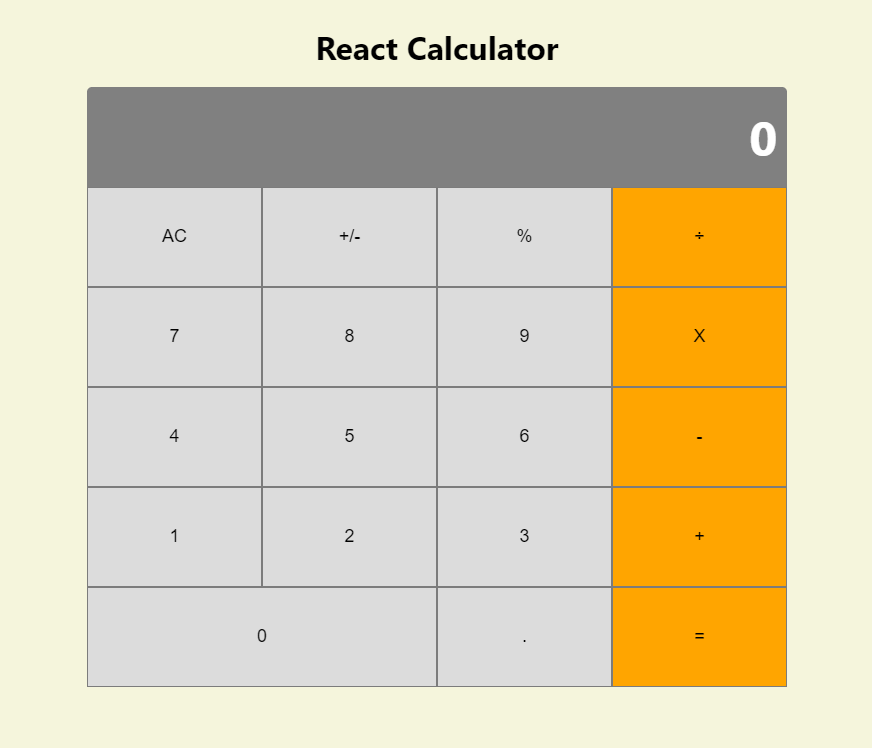

# React Calculator

> A Calculator App built with React.



Additional description about the project and its features.

## Built With

- React
- HTML
- SASS
- Heroku

## Live Demo

[Live Demo Link](https://stark-anchorage-26487.herokuapp.com/)


## Getting Started

To get a local copy up and running follow these simple example steps.

### Prerequisites

- npm
- [Heroku CLI](https://devcenter.heroku.com/articles/heroku-cli)

### Setup

Clone or download the repo:

```
git clone https://github.com/abdelp/react-calculator.git
```

### Install

Go to the root directory of the repo and install the npm packages:

```
npm i
```

### Usage

To start the server you just need to run the start script:

```
npm start
```

### Deployment

To deploy to Heroku you need to create the repo:

```
heroku create -b https://github.com/mars/create-react-app-buildpack.git
```

And push the project to it:

```
git push heroku master
```

## Author

👤 **Abdel Pérez**

- GitHub: [@AbdelP](https://github.com/abdelp)
- Twitter: [@AbdelPerez11](https://twitter.com/AbdelPerez11)
- LinkedIn: [abdel-perez](https://linkedin.com/in/abdel-perez)


## 🤝 Contributing

Contributions, issues, and feature requests are welcome!

Feel free to check the [issues page](issues/).

## Show your support

Give a ⭐️ if you like this project!

## Acknowledgments

- Hat tip to anyone whose code was used
- Inspiration
- etc

## 📝 License

This project is [MIT](lic.url) licensed.
